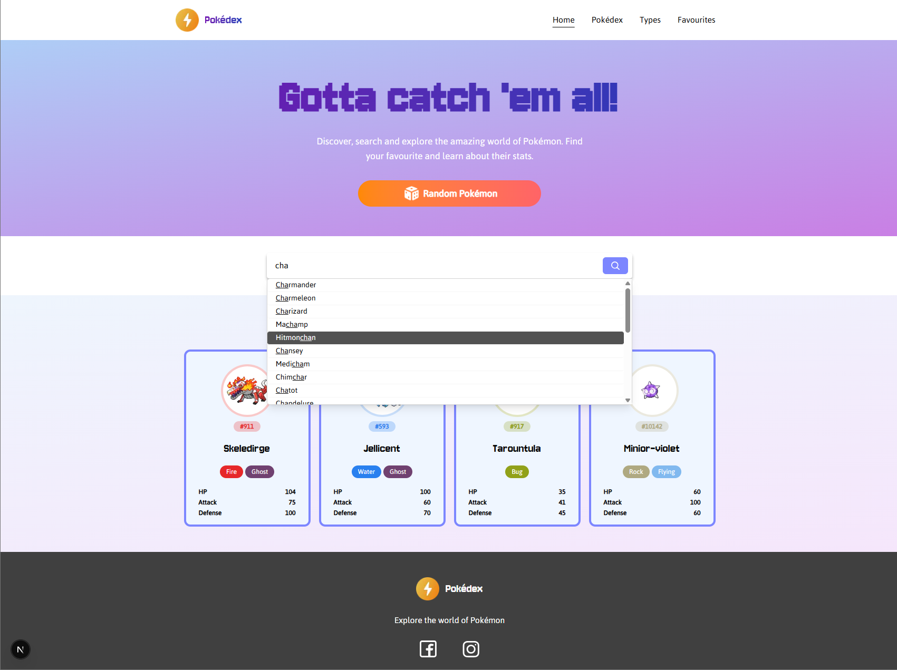
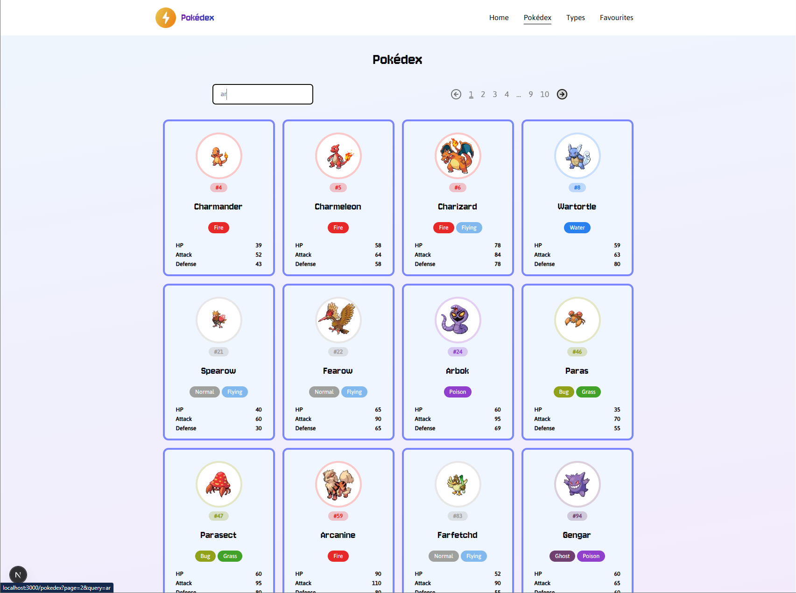
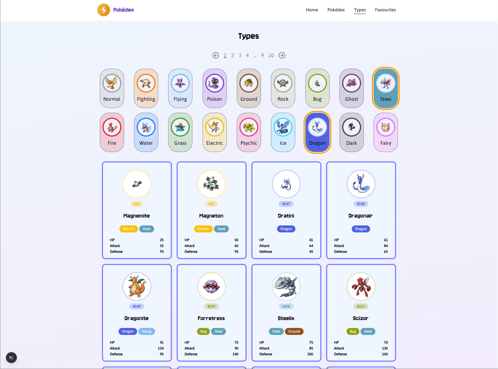

# Pokédex uppgift

## Overview

This project is an exercise focused on fetching and handling data from APIs and working with Server and Client component patterns in Next.js App Router. **Pokédex** uses the [PokéAPI RESTful API](https://pokeapi.co/) to display basic information about every Pokémon, and allow the user to search and filter by Pokémon type.

### Features

- 🏠 **Home Page**: Featured section with randomly selected Pokémon
- 🔍 **Search**: Search for specific Pokémon by name and filter by search term
- 🧩 **Type Filtering**: Browse Pokémon by type (Fire, Water, Grass, etc.)
- ⚡ **Server-Side Rendering**: Fast loading with Next.js server components and Suspense boundaries
- 🎯 **Modal Views**: Detailed Pokémon information in overlay modals with dynamic route interception

<table>
    <tr>
        <td>
            
            <i>Home page with search</i>
        </td>
        <td>
            
            <i>Paginated Pokédex with query filter</i>
        </td>
    </tr>
    <tr>
        <td>
            
            <i>Filter by Pokémon type</i>
        </td>
        <td>
            
            <i>Modal for individual cards</i>
        </td>
    </tr>
</table>

## Technologies Used

- Next.js
- React
- Typescript
- Tailwind CSS 4
- Lucide
- use-debounce

## How to Run

1. Clone this repository:

```bash
git clone https://github.com/jplimmer/pokedex_uppgift.git
```

2. Install packages:

```bash
npm install
```

3. Run the development server:

```bash
npm run dev
```

4. Open [http://localhost:3000](http://localhost:3000) in your browser to view the site.

## Project Structure

```
├── public/
│   └── (static assets)
├── src/
│   ├── app/
│   │   ├── @modal/
│   │   ├── pokedex/
│   │   ├── types/
│   │   ├── globals.css
│   │   ├── layout.tsx
│   │   ├── loading.tsx
│   │   ├── not-found.tsx
│   │   └── page.tsx
│   ├── components/
│   │   ├── error/
│   │   ├── layout/
│   │   ├── loading/
│   │   ├── pokemon/
│   │   ├── skeletons/
│   │   └── ui/
│   ├── lib/
│   │   ├── actions/
│   │   ├── data/
│   │   ├── types/
│   │   └── constants.ts
│   └── utils/
├── .gitignore
├── next.config.ts
├── package.json
└── README.md
```
